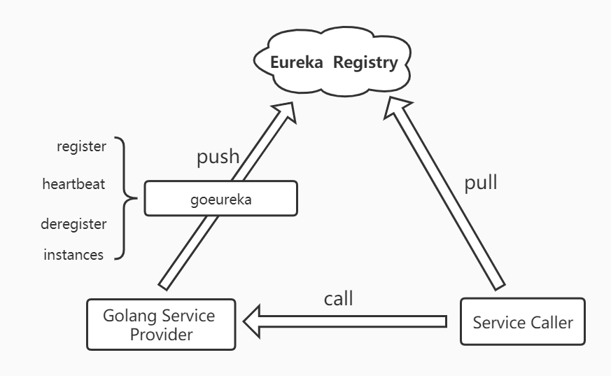

# goeureka

[](https://github.com/SimonWang00/goeureka/graphs/contributors)

提供Go微服务客户端注册到Eureka中心。（通过测试验证，已用于生产）



## 功能特性

本项目封装了Eureka rest操作，实现了以下功能：

- 支持服务注册 
- 支持服务租约续期
- 支持自动取消注册 
- 支持通过代理注册
- 支持账户登录（不登陆，将opt设置为nil即可）


本插件中register 、heartbeat 和deregister基本上可以实现微服务注册到Eureka中心。register方法是通过心跳与Eureka服务端保持通信，当Eureka客户端和服务端注册成功后，则每30秒钟发送一次心跳。当您的微服务实例通过Sigterm或OS中断信号退出时，则本客户端会在关闭之前注销Eureka，以确保服务实例不会发生冲突。

## 使用方法

工具包的导入方法：

```go
import "github.com/SimonWang00/goeureka"
```

注册代码如下：

```go
opt := make(map[string]string)
opt["username"] = "admin"
opt["password"] = "admin123"
// 加载配置
goeureka.RegisterClient("http://127.0.0.1:8028","",
    "golang-server-test", strconv.Itoa(8888),
    strconv.Itoa(43), opt)
```

> **Notes:** RegisterClient 为web server对应的端口号，涉及到异地机房联调采用docker部署的话，需要映射公网IP（添加注册代理），如59.172.3.26，
> 无需添加代理的话为""即可。

或者

```go
goeureka.RegisterClient("http://127.0.0.1:8761","","my-goserver", "8000", "43",nil)
```

> **Notes：**
> - 第二项参数为空代表默认使用本机IP地址;
> - nil代表opt不需要登录账户和密码注册；

## 使用示例

**在http中使用：**

```go
import (
	"fmt"
	"github.com/SimonWang00/goeureka"
	"net/http"
)

func main()  {
    opt := make(map[string]string)
    opt["username"] = "admin"
    opt["password"] = "admin123"
	goeureka.RegisterClient("http://127.0.0.1:8761","","myapp", "8000", "43",opt)
	http.HandleFunc("/hello", func(responseWriter http.ResponseWriter, request *http.Request) {
		resp := "hello goeureka!"
		_, _ = responseWriter.Write([]byte(resp))
	})
	// start server
	if err := http.ListenAndServe("127.0.0.1:8000", nil); err != nil {
		fmt.Println(err)
	}
}
```

**在gin框架中使用：**

```go
import (
	"github.com/SimonWang00/goeureka"
	"github.com/gin-gonic/gin"
)

func main()  {
    r := gin.Default()
    r.GET("hello", func(c *gin.Context) {
        c.String(200, "hello goeureka")
    })
    opt := make(map[string]string)
    opt["username"] = "admin"
    opt["password"] = "admin123"
    goeureka.RegisterClient("http://127.0.0.1:8761","","myapp", "8000", "43",opt)
    r.Run("127.0.0.1:8000")
}
```

## Test

 通过了测试，已经用于golang的微服务生产环境。

java端测试代码

[eurekaconsumer](!https://github.com/SimonWang00/eurekaconsumer.git)